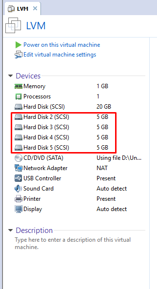
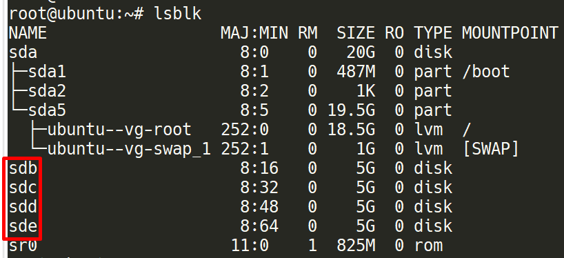

# Thực hành cơ bản
Bài lab này sẽ thực hiện các thao tác cơ bản khi làm việc với LVM

Chuẩn bị một máy ảo Ubuntu server 16.04. Máy ảo được thêm 4 ổ cứng như sau:

	
	
## 1. Tạo ra các logical volume để sử dụng
#### Bước 1: List danh sách các ổ đĩa có trên hệ thống (Hard drives)
- Sử dụng `lsblk`

	
	
- sdb, sdc, sdd, sde là các ổ đĩa mà chúng ta đã thêm vào

#### Bước 2: Tạo partition
- Từ các Hard Drives trên hệ thống, tạo các partition. Ví dụng sử dụng lệnh `fdisk /dev/sdb` để thực hiện tạo partition cho ổ `/dev/sdb`

	
	
- Trong đó bạn chọn `n` để bắt đầu tạo partition
- Bạn chọn `p` để tạo partition primary
- Bạn chọn `1` để tạo partition primary 1
- Tại `First sector (2048-20971519, default 2048)` bạn để mặc định
- Tại `Last sector, +sectors or +size{K,M,G} (2048-20971519, default 20971519)` bạn chọn `+1G` để partition bạn tạo ra có dung lượng 1 G
- Bạn chọn `w` để lưu lại và thoát.
- Tiếp theo bạn thay đổi định dạng của partition vừa mới tạo thành LVM

	
	
- Làm tương tự, ta tạo ra 6 partition như sau:

	
	
#### Bước 3: Tạo physical volume
- Mỗi partition tương ứng với một physical volume.
- Tạo physical volume cho `/dev/sdb1`: `prcreate /dev/sdb1`
- Làm tương tự cho các paritition khác.
- Kiểm tra các physical volumes

```sh
root@ubuntu:~# pvs
  PV         VG        Fmt  Attr PSize  PFree
  /dev/sda5  ubuntu-vg lvm2 a--  19.52g    0
  /dev/sdb1            lvm2 ---   1.00g 1.00g
  /dev/sdb2            lvm2 ---   1.00g 1.00g
  /dev/sdb3            lvm2 ---   1.00g 1.00g
  /dev/sdc1            lvm2 ---   1.00g 1.00g
  /dev/sdc2            lvm2 ---   1.00g 1.00g
  /dev/sdc3            lvm2 ---   1.00g 1.00g
```

#### Bước 4: tạo volume groups
- Bước tiếp theo sẽ nhóm các Physical Volume thành 1 Volume Group bằng cách sử dụng câu lệnh sau:

```sh
root@ubuntu:~# vgcreate vg-demo1 /dev/sdb1 /dev/sdc1
  Volume group "vg-demo1" successfully created
```

- Kiểm tra volume group vừa tạo bằng lệnh `vgs` hoặc `vgdisplay`

```sh
root@ubuntu:~# vgs
  VG        #PV #LV #SN Attr   VSize  VFree
  ubuntu-vg   1   2   0 wz--n- 19.52g    0
  vg-demo1    2   0   0 wz--n-  1.99g 1.99g
```

#### Bước 5: Tạo logical volume
- Tạo logical volume bằng lệnh sau:

```sh
root@ubuntu:~# lvcreate -L 1G -n lv-1 vg-demo1
  Logical volume "lv-1" created.
```

	- `-L`: dung lượng cho lv
	- `-n`: tên lv
	- `vg-demo1`: tên của volume group vừa tạo ở bước trước

- lưu ý: Dung lượng của lv không được vượt quá dung lượng của volume group
- Kiểm tra lại các lv đã tạo 

```sh
root@ubuntu:~# lvs
  LV     VG        Attr       LSize  Pool Origin Data%  Meta%  Move Log Cpy%Sync Convert
  root   ubuntu-vg -wi-ao---- 18.52g
  swap_1 ubuntu-vg -wi-ao----  1.00g
  lv-1   vg-demo1  -wi-a-----  1.00g
```

#### Bước 6: định dạng lv đã tạo
- Lv phải được format trước khi được sử dụng

```sh
mkfs -t ext4 /dev/vg-demo1/lv-1
```

#### Bước 7: Thực hiện mount và sử dụng
- Sau khi format xong lv, lv đã sẵn sàng để sử dụng

```sh
~# mkdir /demo
~# mount /dev/vg-demo1/lv-1 /demo
~# df -h
Filesystem                   Size  Used Avail Use% Mounted on
udev                         468M     0  468M   0% /dev
tmpfs                         98M  4.6M   93M   5% /run
/dev/mapper/ubuntu--vg-root   19G  2.1G   16G  13% /
tmpfs                        488M     0  488M   0% /dev/shm
tmpfs                        5.0M     0  5.0M   0% /run/lock
tmpfs                        488M     0  488M   0% /sys/fs/cgroup
/dev/sda1                    472M  155M  294M  35% /boot
tmpfs                         98M     0   98M   0% /run/user/0
/dev/mapper/vg--demo1-lv--1  976M  1.3M  908M   1% /demo
```
---
Như vậy chúng ta đã có thể sử dụng lv để thực hiện đọc ghi dữ liệu.

## 2. Thực hiện thay đổi dung lượng cho logical volume
- phần này sẽ thực hiện thay đổi dung lượng của một logical volume.
- Kiểm tra lại các thông tin

```sh
root@ubuntu:~# lvdisplay
  --- Logical volume ---
  LV Path                /dev/vg-demo1/lv-1
  LV Name                lv-1
  VG Name                vg-demo1
  LV UUID                dqaZEy-ZtMH-NThV-LdIA-IvjQ-bhGH-xWVSr7
  LV Write Access        read/write
  LV Creation host, time ubuntu, 2018-04-12 09:09:22 +0700
  LV Status              available
  # open                 1
  LV Size                1.00 GiB
  Current LE             256
  Segments               2
  Allocation             inherit
  Read ahead sectors     auto
  - currently set to     256
  Block device           252:2

root@ubuntu:~# vgdisplay
  --- Volume group ---
  VG Name               vg-demo1
  System ID
  Format                lvm2
  Metadata Areas        2
  Metadata Sequence No  2
  VG Access             read/write
  VG Status             resizable
  MAX LV                0
  Cur LV                1
  Open LV               1
  Max PV                0
  Cur PV                2
  Act PV                2
  VG Size               1.99 GiB
  PE Size               4.00 MiB
  Total PE              510
  Alloc PE / Size       256 / 1.00 GiB
  
  VG UUID               MQgq1Z-pDdh-TdVp-dA2y-cDST-EQzs-FP6KlJ
	
root@ubuntu:~# pvs
  PV         VG        Fmt  Attr PSize    PFreeFree  PE / Size       254 / 1016.00 MiB
  /dev/sda5  ubuntu-vg lvm2 a--    19.52g       0
  /dev/sdb1  vg-demo1  lvm2 a--  1020.00m       0
  /dev/sdb2            lvm2 ---     1.00g    1.00g
  /dev/sdb3            lvm2 ---     1.00g    1.00g
  /dev/sdc1  vg-demo1  lvm2 a--  1020.00m 1016.00m
  /dev/sdc2            lvm2 ---     1.00g    1.00g
  /dev/sdc3            lvm2 ---     1.00g    1.00g
	
```

- Kiểm tra lv cần được thay đổi dung lượng được tạo ra từ volume group nào. Ở trên ta thầy `lv-1` được tạo ra từ `vg-demo1`
- Để tăng dung lượng cho lv-1 thì vg-demo1 phải có khả năng cấp phát thêm dung lượng. 
- Kiểm tra thông tin của vg-demo1. Ta thấy `VG Status: resizable` có nghĩa là VG có khả năng cấp phát dung lượng. Và `Free  PE / Size       254 / 1016.00 MiB` để xem dung lượng còn trống của VG.
- Như vậy `lv-1` có thể được tăng thêm dung lượng. Thực hiện các bước sau để tăng dung lượng cho lv-1

```sh
~# lvextend -L +50M /dev/vg-demo1/lv-1
  Rounding size to boundary between physical extents: 52.00 MiB
  Size of logical volume vg-demo1/lv-1 changed from 1.00 GiB (256 extents) to 1.05 GiB (269 extents).
  Logical volume lv-1 successfully resized.
```

- `-L`: để chỉ dung lượng sẽ thêm cho lv. Ở đây lv-1 sẽ được tăng thêm 50Mb.
- Kiểm tra lại dung lượng của lv-1

```sh
:~# lvs
  LV     VG        Attr       LSize  Pool Origin Data%  Meta%  Move Log Cpy%Sync Convert
  root   ubuntu-vg -wi-ao---- 18.52g
  swap_1 ubuntu-vg -wi-ao----  1.00g
  lv-1   vg-demo1  -wi-ao----  1.05g
```

Sau khi tăng kích thước cho Logical Volume thì Logical Volume đã được tăng nhưng file system trên volume này vẫn chưa thay đổi, bạn phải sử dụng lệnh sau để thay đổi:

```sh
resize2fs /dev/vg-demo1/lv-1
```

- Trước và sau khi thay đổi dung lượng trên file system

```sh
# Trước
~# df -h
Filesystem                   Size  Used Avail Use% Mounted on
udev                         468M     0  468M   0% /dev
tmpfs                         98M  4.6M   93M   5% /run
/dev/mapper/ubuntu--vg-root   19G  2.1G   16G  13% /
tmpfs                        488M     0  488M   0% /dev/shm
tmpfs                        5.0M     0  5.0M   0% /run/lock
tmpfs                        488M     0  488M   0% /sys/fs/cgroup
/dev/sda1                    472M  155M  294M  35% /boot
tmpfs                         98M     0   98M   0% /run/user/0
/dev/mapper/vg--demo1-lv--1  976M  1.3M  908M   1% /demo

# Sau
~# df -h
Filesystem                   Size  Used Avail Use% Mounted on
udev                         468M     0  468M   0% /dev
tmpfs                         98M  4.6M   93M   5% /run
/dev/mapper/ubuntu--vg-root   19G  2.1G   16G  13% /
tmpfs                        488M     0  488M   0% /dev/shm
tmpfs                        5.0M     0  5.0M   0% /run/lock
tmpfs                        488M     0  488M   0% /sys/fs/cgroup
/dev/sda1                    472M  155M  294M  35% /boot
tmpfs                         98M     0   98M   0% /run/user/0
/dev/mapper/vg--demo1-lv--1  1.1G  1.3M  956M   1% /demo
```

#### Giảm dung lượng lv-1
- Để giảm dung lượng cho lv-1, ta cần thực hiện các bước sau:
- 1. Phải umount 

```sh
~# umount /dev/vg-demo1/lv-1
```

- 2. Tiến hành giảm kích thước của Logical Volume

```sh
# lvreduce -L 100M /dev/vg-demo1/lv-1
```

- Sau đó tiến hành format lại lv-1 

```sh
mkfs.ext4 /dev/vg-demo1/lv-1
```

- 3. Cuối cùng là mount lại Logical Volume

```sh
# mount /dev/vg-demo1/lv-1 /demo
```

- Lưu ý: dữ liệu cũ sẽ bị mất hết sau khi format.

## 3. Thay đổi dung lượng của Volume Group
- Ở phần trước mình có thể tăng kích thước của Logical Volume nhưng với điều kiện Volume Group của Logical Volume đó còn dung lượng. Phần này chúng ta sẽ tìm hiểu xem làm thế nào có thể mở rộng thêm kích thước của Volume Group cũng như thu hồi dung lượng của nó

- Việc thay đổi kích thước của Volume Group chính là việc nhóm thêm Physical Volume hay thu hồi Physical Volume ra khỏi Volume Group

- Kiểm tra các vg

```sh
~# vgs
  VG        #PV #LV #SN Attr   VSize  VFree
  ubuntu-vg   1   2   0 wz--n- 19.52g    0
  vg-demo1    2   1   0 wz--n-  1.99g 1.89g
```	

- Thực hiện thêm physical volume cho volume group

```sh
~# vgextend /dev/vg-demo1 /dev/sdb2 /dev/sdb3
  Volume group "vg-demo1" successfully extended
```

- Dung lượng của vg sau khi tăng

```sh
:~# vgs
  VG        #PV #LV #SN Attr   VSize  VFree
  ubuntu-vg   1   2   0 wz--n- 19.52g    0
  vg-demo1    4   1   0 wz--n-  3.98g 3.89g
```

- Giảm dung lượng vg (cắt physical volume ra khỏi vg)

```sh
~# vgreduce /dev/vg-demo1 /dev/sdb3
```

## 4. Xóa Logical volume, Volume Group, Physical volume
#### Xóa Logical Volumes
- Trước tiên ta phải Umount Logical Volume

```sh
# umount /dev/vg-demo1/lv-1
```

- Sau đó tiến hành xóa Logical Volume bằng câu lệnh sau:

```sh
# lvremove /dev/vg-demo1/lv-1
```

#### Xóa Volume Group
- Trước khi xóa Volume Group, chúng ta phải xóa Logical Volume
- Xóa Volume Group bằng cách sử dụng lệnh sau:

```sh
~# vgremove /dev/vg-demo1
```

#### Xóa Physical Volume
- Cuối cùng là xóa Physical Volume:

```sh
~# pvremove /dev/sdb3
```
---


Tài liệu tham khảo:

https://www.tecmint.com/extend-and-reduce-lvms-in-linux/

https://www.tecmint.com/manage-multiple-lvm-disks-using-striping-io/

https://www.tecmint.com/create-lvm-storage-in-linux/

http://www.markus-gattol.name/ws/lvm.html#sec29