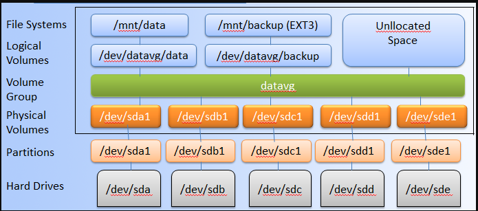

# LVM

## Tổng quan về LVM

### LVM là gì?
- LVM (Logical Volume Manager) là một kỹ thuật chuyển đổi từ không gian đĩa cứng (vật lý) sang logical volume, linh hoạt cho việc thay đổi kích thước dung lượng (dễ dàng hơn so với partition vật lý trên ổ đĩa). 
- Áp dụng LVM sẽ đảm bảo cho hệ thống hoạt động không bị gián đoạn về mặt lưu trữ. Khi volume dùng để lưu trữ đã đầy, ta có thể dễ dàng tăng dung lượng volume. 
- Quản lý tài nguyên lưu trữ hiệu quả hơn. Phụ thuộc vào nhu cầu sử dụng mà dung lượng volume được sẽ được cấp phát bấy nhiêu, không gây lãng phí tài nguyên.
- ....

### Các tính năng của LVM
- Tạo ra các logical volume, phục vụ lưu trữ như những volume vật lý.
- Snapshot volume
- Thin Provisioning Volumes
- LVM Migration.

### Thành phần của LVM
- LVM được tổ chức theo kiến trúc phân tầng
- Kiến trúc phần tầng của LVM như sau:

	
	
- Ở hình trên, ta thấy LVM chia làm 6 phân tầng. Ý nghĩa các tầng như sau:
- `Hard drives`: đây chính là các ổ cứng mà chúng ta thêm vào hệ thống. Trong Linux, các ổ đĩa sẽ được gán lable, ví dụ: `/dev/sdb`. Việc đánh lable này không giống nhau.
- `Partitions`: Lên một mức cao hơn hard drives đó là partitions. Partition (phân vùng) là các phân vùng ổ đĩa cứng. Mỗi ổ đĩa cứng phải có ít nhất một phân vùng.
	- Có 2 loại phần vùng: `primary` và `extends`
	
	primary: mỗi ổ cứng sẽ có 4 phân vùng dạng primay. Đây là phân vùng chính có thể dùng để cài đặt OS.
	extend: là phân vùng mở rộng có thể được dùng để tạo ra các vùng luận lý.
	
- `Physical Volumes`

	Là một cách gọi khác của partition trong kỹ thuật LVM, nó là những thành phần cơ bản được sử dụng bởi LVM. Một Physical Volume không thể mở rộng ra ngoài phạm vi một ổ đĩa.

	Chúng ta có thể kết hợp nhiều Physical Volume thành Volume Groups
	
- `Volume groups` 

	Là tập hợp của nhiều physical volumes
	
	

	dung lượng của volume groups bằng tổng dung lượng các physical volume.
	
- `Logical volumes`

	Được tạo ra từ volume groups. Dung lượng của logical volume không thể vượt quá dung lượng của volume group. Logical volume sẽ được format, mount để sử dụng
	
	

- `File system`: là tầng cao nhất trong LVM, chịu trách nhiệm quản lý, tổ chức, cách thức lưu trữ, ... các file.

